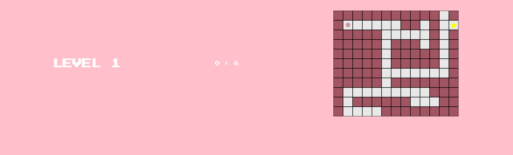

# Maze
The goal of this game is to move the ball to the destination. Destination is represented as a small star. Passes the destination, the game will be finished.

## Screenshots

 ## Tech/framework used

<b>Built with</b>
- HTML
- CSS 
- JAVASCRIPT

## Features
- Multiple levels 
- Timer
- Cute colors 
## How to use?
1) tilt maze game
The ball only moves in a straight line, and the ball does not stop until the walls.

2) classic maze game
The ball stops at the aisle. The user is able to move the ball in the desired direction.

## Future Release

- Moving maze game
If you touch the dark part of the wall of the maze, you can rotate the maze walls.
Whenever you touch the maze wall, it rotates in a clockwise direction.
When you rotate the wall which blocked, the new pathway opens. You can move the ball to the new pathway.
If the wall is rotated, new pathway is created.